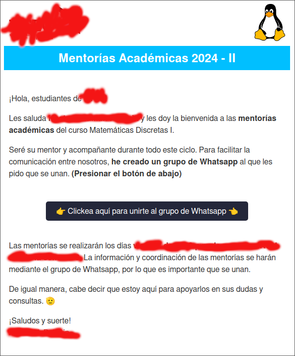

 # Flyer de UTEC para Gmail
Código de html que simula a los flyers de la UTEC con el fin de enviarlo por g-mail.

Este flyer consta de:
- Cabecera para dos logos (izquierdo y derecho)
- Título
- Saludo
- 4 bloques para texto
- 1 botón para hipervínculo en el centro
- "Pie de página" (Aquí normalmente te despides)
Obviamente lo puedes modificar como quieras.

# ¿Cómo puedo enviar este afiche por correo y que este se muestre correctamente?

Debido a que Gmail soporta html, aquí están los pasos para que lo interprete:

1. Abre el archivo flyer.html (luego de tu modificaciones) en tu navegador.
2. Presionar "Ctrl + A" para seleccionar el contenido de la página y luego "Ctrl + C" para copiar la selección.
3. Ir a Gmail, presionar el botón de redactar y pegar en el cuerpo del correo lo que acabas de copiar. 
4. Gmail debería de rendizarlo y listo. Solo bastaría incluir el destinatario al que quieres enviar el correo y colocar un asunto

# Problemas
Puede que Gmail no renderize o interprete bien CSS, por lo que puede que se tenga que re-modificar el código.

# Legalidad
Espero que esto no sea nada ilegal, lo hice con buenas intenciones. De tal forma que los mentores académicos puedan enviar correos a sus mentees similares a los correos de UTEC 😹.

